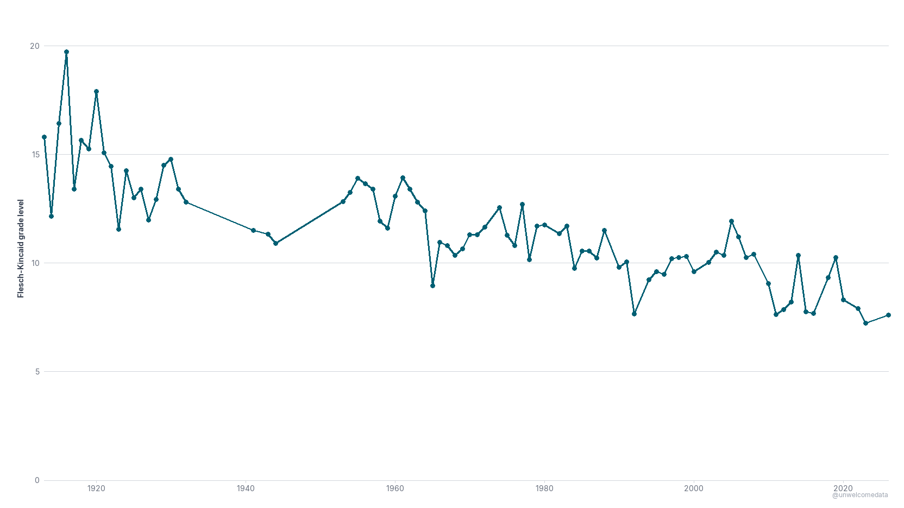
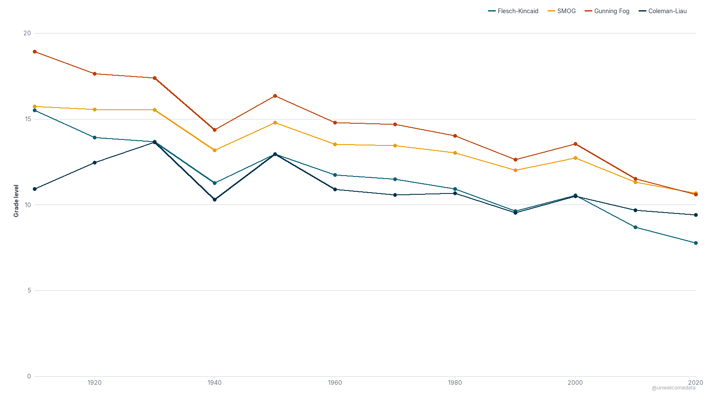
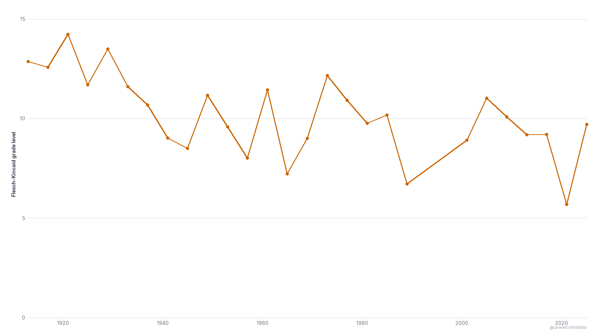

# Presidential Readability

**[@unwelcomedata](https://github.com/unwelcomedata)** · data from public sources

**Have presidential speeches gotten simpler over time?** Yes — markedly. This project
measures the **reading-grade level** of U.S. presidential oratory across the
spoken/broadcast era (1913–present) and finds a clear long-term decline: the State of the
Union has fallen from a mid-teens/college reading level to around **8th grade** today.

Reading grade is measured with **Flesch–Kincaid** (and three companion formulas as a
cross-check). A higher number means more complex text — roughly, the U.S. school grade you'd
need to read it comfortably.

---

## The State of the Union got simpler

[](docs/01_sotu_readability.png)

Average Flesch–Kincaid grade level of each State-of-the-Union address, **spoken/broadcast
era (1913 on)**. The series starts in 1913 on purpose — see *How it was measured* below.

## Four formulas agree

[](docs/02_sotu_four_formulas.png)

Flesch–Kincaid, SMOG, Gunning Fog, and Coleman–Liau, averaged by decade. They all trend the
same way — the decline isn't an artifact of one formula's quirks.

## Inaugurals too

[](docs/03_inaugural_readability.png)

Inaugural addresses — a different, always-spoken speech type — show the same downward drift
(noisier, since it's one speech per term).

---

## How it was measured

- **Source:** the University of Virginia **Miller Center** curated corpus of major
  presidential speeches (public domain). See [SOURCES.md](SOURCES.md).
- **Metric:** **Flesch–Kincaid Grade Level** (lead), plus SMOG, Gunning Fog, and
  Coleman–Liau as companions. Grade formulas are computed from word/syllable counts and
  **sentence counts from the NLTK punkt tokenizer** (a reliable sentence splitter matters —
  see the caveats).
- **What's included:** real delivered **oratory only** — the State-of-the-Union series
  (Annual Message + State of the Union) and inaugural addresses. Proclamations, veto
  messages, and other legal/administrative documents are excluded; scored as prose they
  produce absurd grades (one 1795 proclamation is a single 382-word sentence).
- **Why it starts at 1913:** before 1913, the annual message to Congress was a **written
  document read aloud by a clerk**, not delivered oratory — and reading formulas are unstable
  on those long, dense historical texts. 1913 (when in-person delivery resumed) is the start
  of the comparable, spoken era. The downloadable dataset keeps the earlier written era too,
  flagged with a `delivery_mode` column.

**Honest limits:**
- Reading formulas measure only **surface features** (sentence length, syllables) — not
  vocabulary sophistication, ideas, or rhetoric. "Simpler to read" ≠ "less substantive."
- **Absolute grade levels are formula- and source-dependent.** Independent analyses that use
  a different transcript archive typically land **2–5 grades lower**, especially before 1980.
  Treat the numbers as a consistent *index*; the **long-term decline replicates** across
  formulas and across independent studies.

## The data

- **[Download the dataset (CSV)](export/presidential_readability_v1.csv)** — one row per
  speech, with each readability score, plus a **[codebook](export/presidential_readability_v1_codebook.md)**
  describing every column.
- Includes both eras (spoken 1913+ and the earlier written era) with a `delivery_mode` flag,
  so you can filter as the charts do.

## Reproduce it

The pipeline is a single standalone command (raw source → published export):

```bash
pip install -r requirements.txt
python scripts/reproduce.py        # Miller Center corpus -> clean -> readability -> export
python scripts/validate_charts.py  # re-checks the chart facts; exits 0 if all good
```

`scripts/reproduce.py` runs the same `src/` logic the analysis uses, in order
(ingest → clean → prepare), and writes a byte-identical export.

## Sources & license

Full attribution, methodology, and series-break notes: **[SOURCES.md](SOURCES.md)**.
Source corpus is public domain (U.S. government works); this project's code and derived
dataset are shared for public use.

---

> **AI-Assisted Development**
> This project was built with the assistance of [Kiro](https://kiro.dev), an AI-powered
> development environment. All data sourcing decisions, methodology choices, and published
> findings are the responsibility of the author. AI was used for code generation, data
> pipeline construction, and research assistance — not for analysis conclusions or editorial
> judgment.
